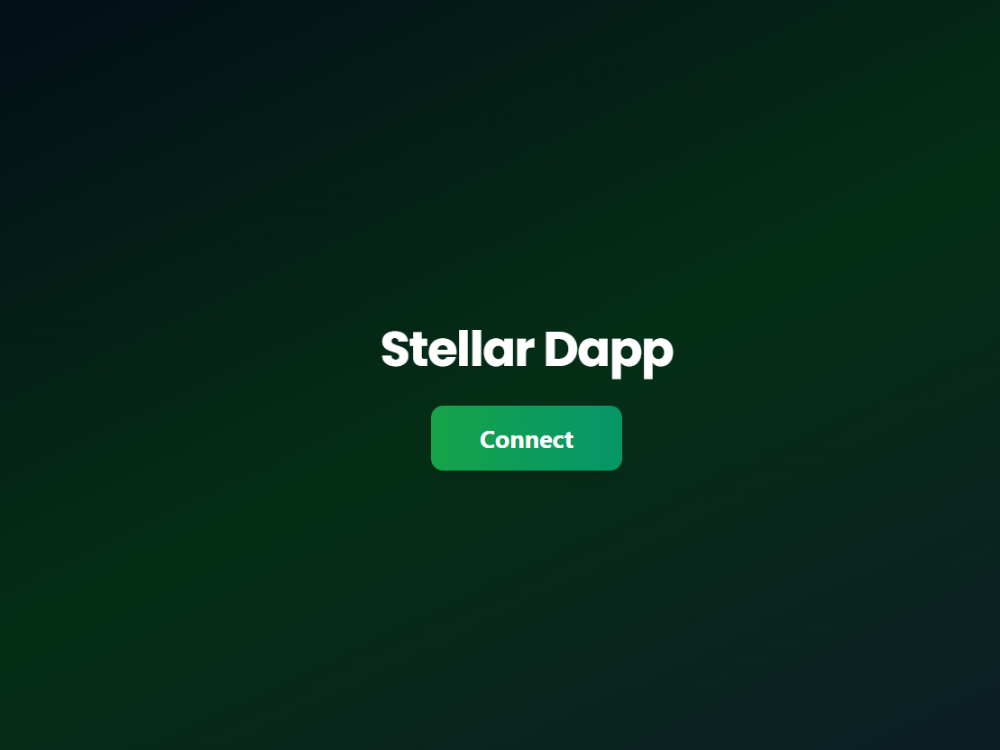
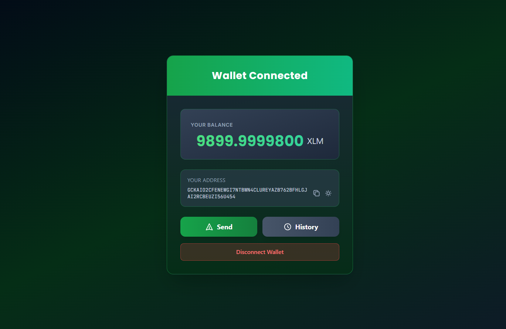
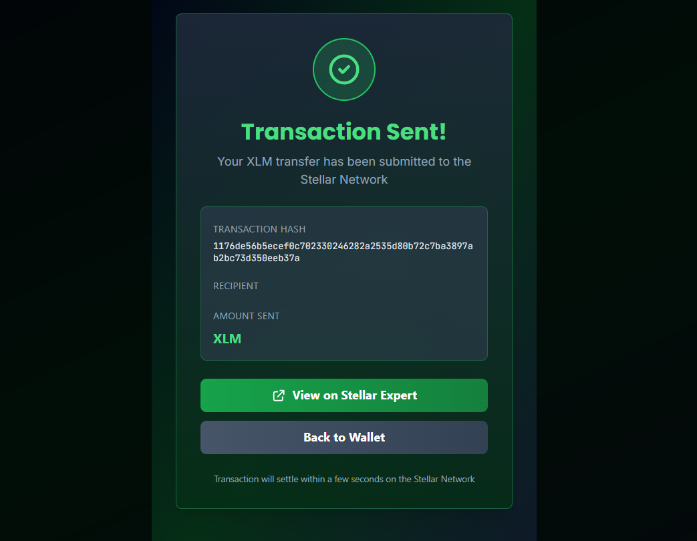
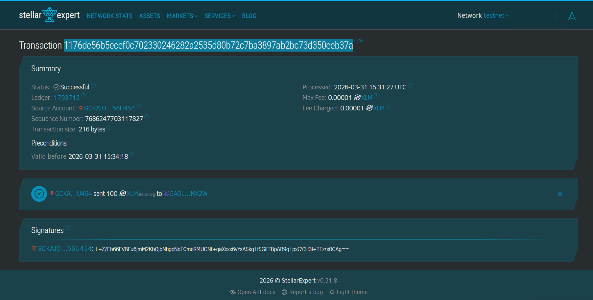

# Stellar Connect Wallet 🌟

A modern, user-friendly web application for managing Stellar (XLM) assets with seamless wallet integration, built with React and styled with Tailwind CSS.


---

## ✨ Features

- **🔗 Wallet Connection**: Seamlessly connect your Freighter wallet with one click
- **💰 Balance Display**: Real-time XLM balance from the Stellar Network
- **📬 Send XLM**: Transfer XLM tokens to other Stellar addresses with ease
- **📊 Transaction History**: View your complete transaction history on Stellar
- **📲 QR Code**: Generate and share your public address via QR code
- **📋 Address Management**: Copy your address to clipboard instantly
- **🔐 Secure**: No private keys stored locally - all transactions signed by Freighter
- **🎨 Beautiful UI**: Modern, responsive interface with smooth animations
- **🌙 Dark Theme**: Eye-friendly dark gradient design

---

## 🚀 Quick Start

### Prerequisites
- Node.js 16+ and npm
- [Freighter Wallet](https://www.freighter.app/) browser extension installed

### Installation

```bash
# Clone the repository
git clone https://github.com/Anmol-345/stellar-connect-wallet.git
cd stellar-connect-wallet

# Install dependencies
npm install

# Start the development server
npm start
```

The app will open at `https://localhost:3000`

### Build for Production

```bash
npm run build
```

---

## 📖 How to Use

### 1. **Connect Your Wallet**
   - Click the "Connect" button on the landing screen
   - Approve the connection in your Freighter wallet popup
   - Your wallet info will appear instantly

### 2. **View Your Balance**
   - Your XLM balance is displayed in the wallet card
   - Updates are fetched from the Stellar Network

### 3. **View Your Address**
   - Click the copy icon to copy your address to clipboard
   - Click the QR code icon to view and share your public address

### 4. **Send XLM**
   - Click the "Send" button
   - Enter recipient address and amount
   - Review the transaction and sign with Freighter
   - Confirm on Stellar Network

### 5. **Check History**
   - Click the "History" button
   - View all your transactions (last 50)
   - See transaction hashes, dates, and types

### 6. **Disconnect**
   - Click "Disconnect Wallet" to exit
   - Your data is cleared - no persistence

---

## 📸 Screenshots

### Landing Page
Initial screen showing "Stellar Dapp" title with Connect button.



### Wallet Connected with Balance Display
Connected wallet showing address, balance (XLM amount), and action buttons for Send/History/Disconnect.



### Successful Testnet Transaction
Transaction confirmation showing successful XLM transfer on the Stellar Testnet.



### Successful Testnet Transaction Proof
Transaction confirmation showing successful XLM transfer on the Stellar Testnet.



---

# TRANSACTION PROOF

```
Transaction Id : 55a5956b65290f3a1f8051e6e02f80055d7a57129e40a13a612eee5c9a096dd3
Processed      : 2026-03-31 12:28:43 UTC

```


---

## 🏗️ Project Structure

```
stellar-connect-wallet/
├── src/
│   ├── components/
│   │   ├── Freighter.js          # Freighter API integration
│   │   ├── SendXLM.js            # Send transaction component
│   │   ├── History.js            # Transaction history component
│   │   └── Header.js             # Header component
│   ├── App.js                    # Main app component
│   ├── App.css                   # App styles
│   ├── index.js                  # Entry point
│   └── index.css                 # Global styles
├── public/
│   ├── index.html                # HTML template
│   ├── manifest.json             # PWA manifest
│   └── robots.txt
├── package.json                  # Dependencies
├── tailwind.config.js            # Tailwind configuration
└── README.md                     # This file
```

---

## 🛠️ Tech Stack

- **Frontend Framework**: [React 19.2](https://react.dev/)
- **Styling**: [Tailwind CSS 3.4](https://tailwindcss.com/)
- **Blockchain Integration**: 
  - [@stellar/stellar-sdk 15.0](https://developers.stellar.org/docs/reference/sdk-reference)
  - [@stellar/freighter-api 6.0](https://www.freighter.app/)
- **QR Code**: [qrcode.react](https://www.npmjs.com/package/qrcode.react)
- **Utilities**: [react-copy-to-clipboard](https://www.npmjs.com/package/react-copy-to-clipboard)
- **Build Tool**: [Create React App](https://create-react-app.dev/)

---

## 🔧 Key Components

### Freighter.js
Handles all blockchain interactions:
- `checkConnection()` - Verify Freighter connection
- `retrievePublicKey()` - Get user's Stellar address
- `getBalance()` - Fetch XLM balance
- `userSignTransaction()` - Sign transactions with Freighter

### SendXLM.js
- Form validation for recipient address and amount
- Real-time Stellar address validation
- Transaction building and signing
- Success/error notifications

### History.js
- Fetches transaction data from Horizon API
- Displays last 50 transactions
- Shows transaction hash, date, type, and memo

---

## 🌐 Network

This application runs on the **Stellar Test Network (Testnet)**.

- **Horizon API**: `https://horizon-testnet.stellar.org`
- **Network Passphrase**: `Test SDF Network ; September 2015`

⚠️ **Note**: No real XLM is used. For testnet lumens, visit the [Stellar Testnet Friendbot](https://laboratory.stellar.org/?network=test#friendbot)

---

## 🔐 Security

- **Private Keys**: Never stored or transmitted - Freighter handles signing
- **Network**: Uses HTTPS for all API calls
- **Testnet Only**: Safe for development and testing
- **No Backend**: All transactions happen directly on-chain

---

## 🎨 UI Features

- **Responsive Design**: Works on desktop and mobile
- **Dark Mode**: Easy on the eyes with professional gradients
- **Smooth Animations**: Fade-in effects and hover transitions
- **Accessible Icons**: SVG icons with clear labels
- **Modal Dialogs**: Non-intrusive Send, History, and QR modals
- **Loading States**: Visual feedback during async operations
- **Error Handling**: Clear error messages and alerts

---

## 📱 Browser Support

- Chrome/Edge 90+
- Firefox 88+
- Safari 14+
- Any browser supporting ES6+ and WebGL

---

## 🚦 Getting Started with Freighter

1. **Install Freighter**:
   - Visit [freighter.app](https://www.freighter.app/)
   - Install for Chrome, Firefox, or Edge

2. **Create/Import Account**:
   - Create a new account or import existing one
   - Save your secret key securely

3. **Add Testnet Account**:
   - Switch to Testnet in Freighter settings
   - Get testnet XLM from [Friendbot](https://laboratory.stellar.org/?network=test#friendbot)

4. **Connect to App**:
   - Open Stellar Connect Wallet
   - Click "Connect"
   - Approve in Freighter popup

---

## 🐛 Troubleshooting

### "Failed to connect wallet"
- Ensure Freighter extension is installed and active
- Check that you're on a supported browser
- Try refreshing the page

### "Invalid Stellar address"
- Verify the recipient address starts with "G"
- Make sure the address is exactly 56 characters
- Use the correct Testnet addresses

### "No balance showing"
- Wait a few seconds for the network to respond
- Ensure your Freighter account as testnet XLM
- Refresh the page and reconnect

### QR Code not generating
- Check browser console for errors
- Ensure your address is loaded correctly
- Try clearing browser cache

---

## 📚 Resources

- **Stellar Documentation**: https://developers.stellar.org/
- **Freighter Docs**: https://www.freighter.app/
- **Horizon API**: https://developers.stellar.org/docs/data/horizon
- **Tailwind CSS**: https://tailwindcss.com/docs
- **React Docs**: https://react.dev/

---

## 🤝 Contributing

Contributions are welcome! To contribute:

1. Fork the repository
2. Create a feature branch (`git checkout -b feature/amazing-feature`)
3. Commit changes (`git commit -m 'Add amazing feature'`)
4. Push to branch (`git push origin feature/amazing-feature`)
5. Open a Pull Request

---

## 📄 License

This project is licensed under the MIT License - see the LICENSE file for details.

---

## 👨‍💻 Author

Created with ❤️ for the Stellar community

---

## ⭐ Support

If you find this project helpful, please consider:
- ⭐ Starring the repository
- 🐛 Reporting bugs
- 💡 Suggesting features
- 📢 Sharing with others

<div align="center">

**Made with React + Stellar ✨**

[Install Freighter](https://www.freighter.app/) • [Stellar Docs](https://developers.stellar.org/) • [Report Bug](https://github.com/yourusername/stellar-connect-wallet/issues)

</div>
